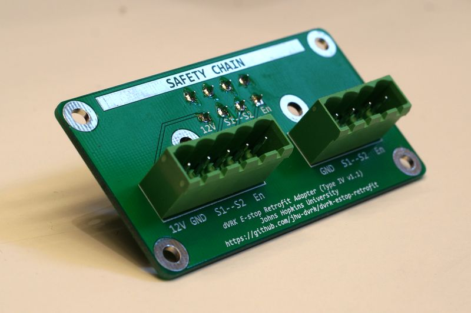
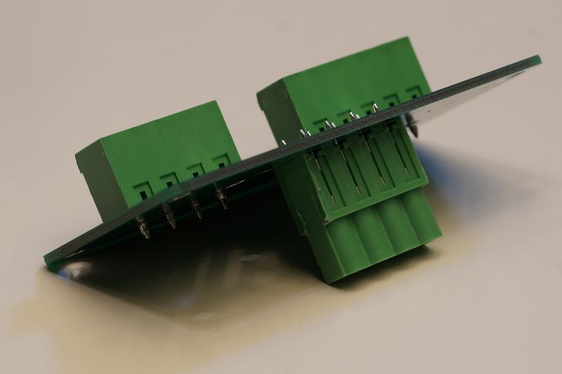
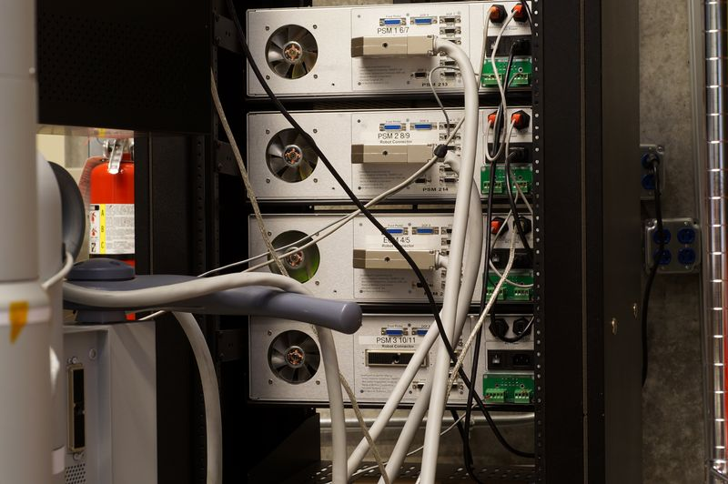
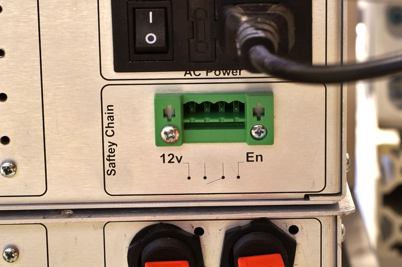
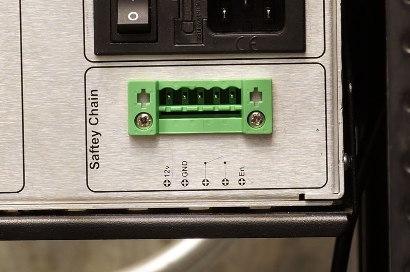
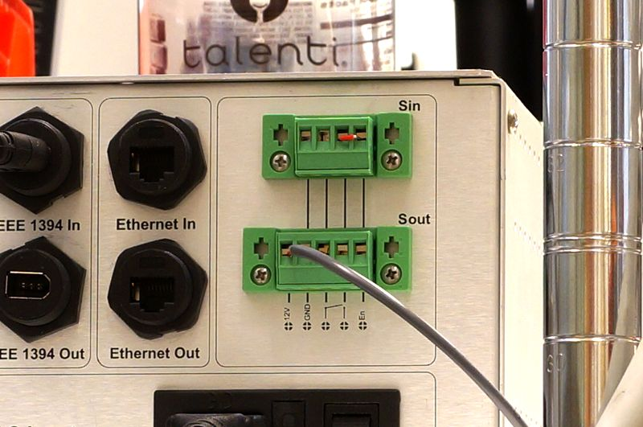
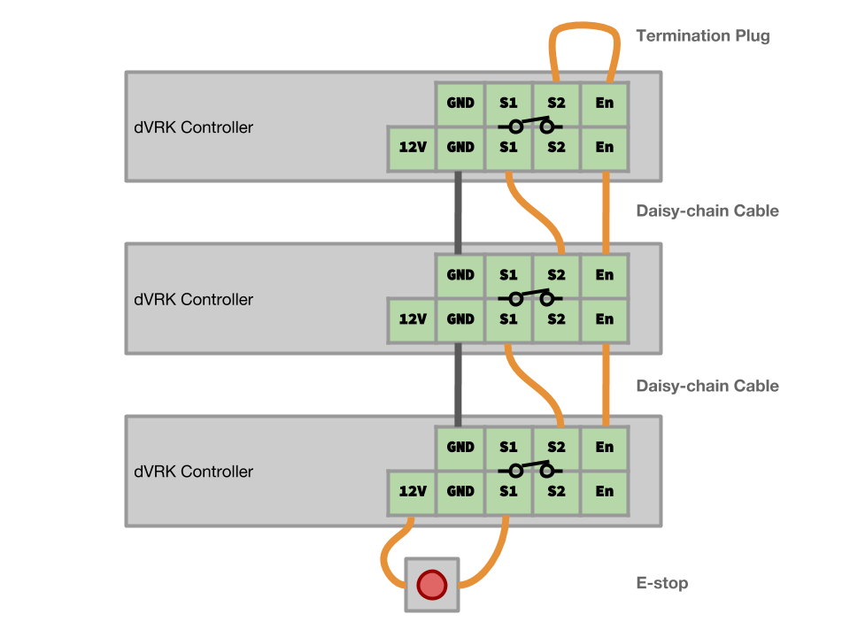
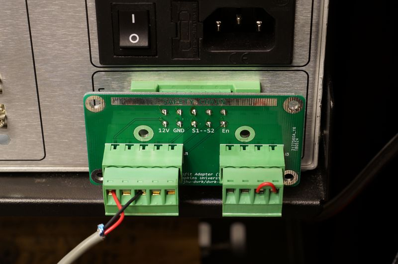

# dVRK E-stop Retrofit Kit

This retrofit kit converts the 4-pin and 5-pin E-stop connectors on old dVRK boxes to the newer 4-and-5-pin connectors.

**Why do I want the new 4-and-5-pin connectors?** The new connectors allow you to use the [JHU-style configurable serial connection](#making-the-cables), so you can quickly reconfigure the dVRK into two or more systems (e.g. one workstation for the MTMs, and another workstation for the PSMs) for different research needs. 

dVRK at JHU with retrofit applied. Top three boxes are connected to one safety chain, and the bottom one is connected to another. PSM3 is used as an one-arm-only dVRK.

# Which "type" do I need?

Look at the back side (connector side) of the dVRK boxes. If you only see a green four-pin safety chain connector, you need `type iv`. If you only see a green five-pin connector, you need `type v`.

The "types" are silkscreened on the retrofit kit PCB. `type iv` has a four-pin PCB mount plug. `type v` has a five-pin plug.

## Four-pin green connector. You need `type iv`.

## Five-pin green connector. You need `type v`.

## Four-and-five-pin connector. You do not need this.

If your dVRK boxes have these four-pin and five-pin connectors, you have the latest connector and you do not need this retrofit kit.

If your dVRK boxes have two five-pin connectors, you do not need this retrofit kit. You can (and should) still use the wiring documented below, but ignore the extra `12V` pin.

# How to use

You should receive an assembled PCB with one screw terminal plug connector for each box. You will reuse the screw terminal plug connectors and the e-stop button that came with your boxes. The retrofit process at JHU took about half an hour for six boxes. 

## Making the cables

Please use the following diagram as a reference to make the cables.

You can use any 3-wire (or more) cables to make the cables. The cable normally carries no more than a few milliamps of current. We strongly recommend using stranded wires, as solid wires tend to fracture under repeated flexing. We recommend using wire ferrules for aesthetics and strain relief, but inserting the bare stranded wires into the screw terminals is fine.

## Plugging it in

If you are using the `type v`, you can directly plug the PCB assembly into the green connector behind the box, then plug the e-stop button, daisy-chain cables, and termination plugs into the PCB assembly. 

If you are using the `type iv`, you can directly plug the PCB assembly into the green connector behind the box if all boxes are sharing the same ground. Usually they are because their ground pin in the IEC connectors are connected at the power strip. If your e-stop already works, you probably have a working ground connection. 

The four-pin e-stop connector does not have a ground pin. If you suspect that you are having a grounding problem, you can replace the screw in the panel-mount green receptacle with longer ones that will extend to the retrofit board. The screw holes on the retrofit PCB are all connected to the ground pins. 

Once you connect all e-stop buttons, cables, and termination plugs, the e-stop should work. Happy dVRKing!

You can 3D print a shroud to make the board sit nicer on the back panel. If you do so, please share the model with us!

# Making your own boards/getting more connectors

Check releases of this repository for the latest gerber files for the PCB. You can upload it to your favorite PCB fab. If you only need a couple boards and you are located in the US, OSHPark is a good option.

The 5.08mm connectors are very standard and a lot of companies make them. If you are looking for more plugs so you can have multiple e-stop chains, any of [these](https://www.digikey.com/products/en/connectors-interconnects/terminal-blocks-headers-plugs-and-sockets/370?FV=1600018%2C1600006%2C1640056%2Cffe00172%2C2dc1f64%2C2dc1f65%2C2dc1f66%2C2dc1f67%2C2dc1f68%2C2dc1f6c%2C2dc1f6d&quantity=0&ColumnSort=0&page=1&pageSize=25) will do. [This
(4-pin)](https://www.digikey.com/product-detail/en/phoenix-contact/1776155/277-6223-ND/348998) and [this (5-pin)](https://www.digikey.com/product-detail/en/phoenix-contact/1776142/277-6473-ND/348997) are particularly nice because they have zip tie anchors.

The PCB mount plugs are hard to find. We used Wurth Elektronik 691307500004 and 691307500005.
